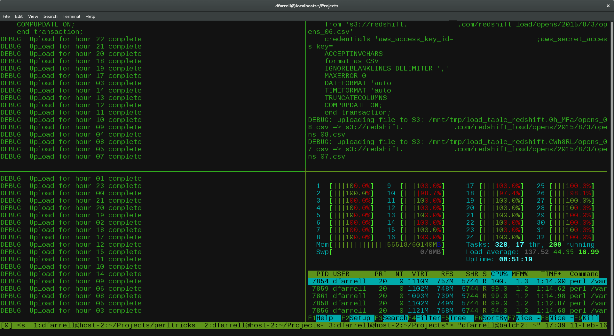

## SSH Keys - logging in without a password

------------------------------------------------------------------------

An SSH key is an access credential, similar to a username/password that grants access to the server from a remote computer. You can set up ssh keys between your computer and the server to enable password-less login.

Firstly create ssh key pairs (public and private) on your own machine (UNIX or Mac terminal):

`ssh-keygen`

This will ask for a pass-phrase. Just hit enter if you want to avoid entering this every time you login. You should use a pass-phrase if you need to protect your ssh keys from any who may have access to your computer.

Next, copy the public key to the server:

`ssh-copy-id username@bifx-core3.bio.ed.ac.uk`

The next time you connect to the server, the SSH protocol will send a message to your computer and attempt to decrypt it with your private key. If it gets the expected response it will authenticate your connection:

`ssh username@bifx-core3.bio.ed.ac.uk`

Further information:

-   [How to set up SSH keys](https://www.digitalocean.com/community/tutorials/ssh-essentials-working-with-ssh-servers-clients-and-keys)

-   [Setting up SSH keys on Windows](https://phoenixnap.com/kb/generate-ssh-key-windows-10)

## Bash configuration

------------------------------------------------------------------------

Coming soon...

## htop

------------------------------------------------------------------------

`htop` is a modified version of `top` for interactive system monitoring. It provides an overview of CPU and memory usage as well as running jobs on the server. You can find out more about how to use `htop` here: <https://www.tecmint.com/htop-linux-process-monitoring/>

By default `htop` will show the usage of each CPU on the machine. Because we have a lot of CPU's this takes up the entire display making it very difficult to navigate. We recommend editing your htop configuration file `~/.config/htop/htopr` to the parameters below. This will reduce the CPU usage to a single bar showing average usage and allow you to use htop as intended!

    # Beware! This file is rewritten by htop when settings are changed in the interface.
    # The parser is also very primitive, and not human-friendly.
    fields=0 48 17 18 38 39 40 2 46 47 49 1
    sort_key=46
    sort_direction=1
    hide_threads=0
    hide_kernel_threads=0
    hide_userland_threads=0
    shadow_other_users=0
    show_thread_names=0
    show_program_path=1
    highlight_base_name=0
    highlight_megabytes=0
    highlight_threads=1
    tree_view=0
    header_margin=0
    detailed_cpu_time=0
    cpu_count_from_zero=0
    update_process_names=0
    account_guest_in_cpu_meter=0
    color_scheme=0
    delay=15
    left_meters=CPU Memory Swap
    left_meter_modes=1 1 1
    right_meters=CPU Tasks LoadAverage Uptime
    right_meter_modes=1 2 2 2

## TMUX - Terminal multiplexer

------------------------------------------------------------------------

**TMUX**, the terminal multiplexer, is a program that allows you to manage persistent server sessions and easily switch between programs in one terminal session.

-   "Detached" **sessions** that continue to run when you close your connection to the server.

-   Manage multiple sessions.

-   Split sessions into **windows** and **panes.**

Further resources:

-   [tmux cheatsheet](https://tmuxcheatsheet.com/)

-   [tmux wiki](https://github.com/tmux/tmux/wiki)

{width="500"}

{width="500"}
